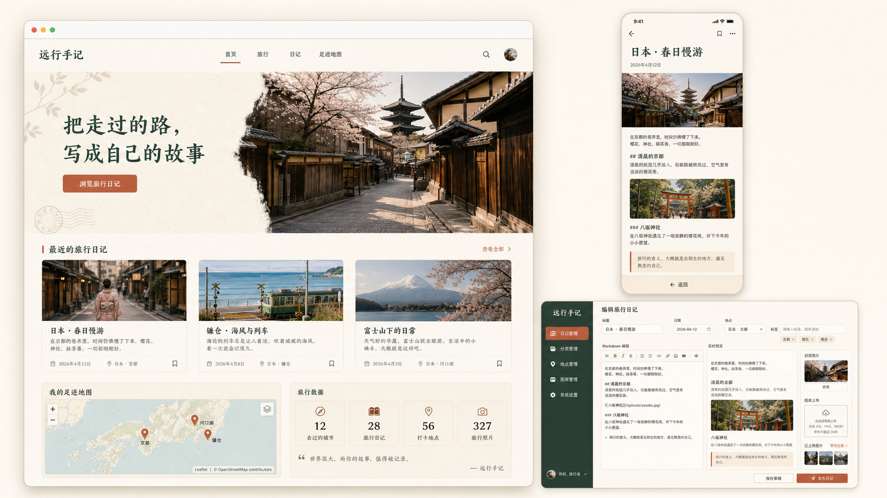

# 个人旅行日记系统开发文档

> 项目名称：Travel Journal  
> 文档状态：方案确认中，未确认前不编写业务代码  
> 使用场景：个人使用；系统只有一个管理员，访客只能浏览已发布内容  
> 运行形态：单体 Web 应用，前后端源码放在同一个 Spring Boot 工程中

---

## 0. 已确认约束

1. 系统以个人使用为目标，不做企业级复杂架构。
2. 前后端代码放在同一个工程中，不建立独立 frontend 工程。
3. 前端使用 Vue 3 浏览器全局构建版，通过普通 script 标签引入，不使用 Node.js、npm、Vite、TypeScript 和 .vue 单文件组件。
4. 项目结构参考 D:\java\IdeaProjects\cms 的单体工程、静态资源组织和多阶段 Dockerfile 构建方式。
5. 只参考 CMS 的工程方式，不复制其业务代码、权限模型、Redis、MySQL、Shiro 或文件系统模块。
6. 本项目直接使用 MinIO Java SDK，实现旅行日记自己的媒体存储服务、数据表和对象键规则。
7. PostgreSQL 和 MinIO 均由使用者自行管理；本项目只提供连接配置，不创建或部署这两个服务。
8. 生产环境只构建一个 Spring Boot 镜像，前端静态文件随 Jar 一起发布。
9. 本文档是当前实现与后续维护的基准；数据库结构只能通过新增 Flyway 迁移演进。
10. 首版视觉方向采用“暖白纸张感 + 森林绿 + 陶土色”的旅行杂志风格，以 docs/assets/travel-journal-ui-direction-v1.png 为实现参考。
11. 主题功能保持个人项目所需的轻量规模：支持内置预设、个人主题 DIY 和三级覆盖，不实现主题商店或任意 CSS/脚本上传。

---

## 1. 产品定义

### 1.1 产品目标

实现一个轻量的个人旅行管理与展示网站：

- 旅行前：创建旅行、添加城市、编排行程、制定预算。
- 旅行中：记录支出、写日记草稿、上传照片。
- 旅行后：整理并发布日记，通过旅行列表、时间线和城市地图对外展示。

### 1.2 用户身份

管理员：

- 系统唯一账号，不提供注册。
- 管理旅行、城市、行程、预算、支出、日记和照片。
- 发布、撤回或删除自己的内容。

公开访客：

- 无需登录。
- 只能查看已发布日记及其关联的旅行、城市和照片。
- 不能访问草稿、预算、支出、内部备注、管理员信息或 MinIO 对象键。

### 1.3 MVP 功能

- 单管理员登录、退出、修改密码。
- 旅行及城市停靠点管理。
- 按日期维护行程。
- 分类预算、实际支出和简单汇总。
- Markdown 日记，支持草稿、发布和撤回。
- 照片上传、排序、说明、封面和删除。
- 公开首页、旅行列表、旅行详情、日记详情和城市地图。
- 手机与桌面浏览器适配。
- PostgreSQL 持久化和 Flyway 数据库迁移。
- MinIO 私有对象存储。
- 单个 Dockerfile 构建与部署。

### 1.4 明确不做

- 多用户、注册、找回密码和复杂角色权限。
- 评论、点赞、收藏、关注和社交登录。
- Redis、消息队列、Elasticsearch、微服务和 Kubernetes。
- GPS 轨迹、实时定位和街道级路线规划。
- 实时汇率、在线订票和 AI 自动写作。
- 视频、HEIC、PWA 和原生 App。
- PostGIS 和复杂地理空间查询。
- 独立前端构建、SSR 和前端工程化工具链。

---

## 2. 技术方案

### 2.1 后端

| 类别 | 选型 |
|---|---|
| 语言 | Java 21 |
| 框架 | Spring Boot 3.x、Spring MVC |
| 安全 | Spring Security、Session Cookie、BCrypt |
| ORM 与数据访问 | MyBatis-Plus（Spring Boot 3 Starter） |
| 数据库 | PostgreSQL |
| 数据库迁移 | Flyway |
| 对象存储 | MinIO Java SDK |
| 参数校验 | Jakarta Validation |
| 接口文档 | springdoc-openapi |
| 图片处理 | Thumbnailator |
| 健康检查 | Spring Boot Actuator |
| 测试 | JUnit 5、Mockito、Spring Boot Test、Testcontainers |
| 构建 | Maven Wrapper |

约束：

- 数据库表只由 Flyway 创建和修改，MyBatis-Plus 不执行自动建表。
- 常规单表 CRUD 使用 MyBatis-Plus；公开查询、统计汇总和多表查询使用显式 Mapper SQL，避免把复杂条件隐藏在 Service 中。
- Entity 不直接作为接口响应。
- MyBatis-Plus 仅作为本项目 ORM 技术选型，不复制 CMS 的 Mapper、实体或业务代码；同时不引入 CMS 的 MySQL、Shiro、Redis 和文件系统模块。
- 按单实例部署设计，Session 保存在应用内存中；容器重启后重新登录是可接受行为。

### 2.2 前端

| 类别 | 选型 |
|---|---|
| 核心框架 | Vue 3 浏览器全局构建版 |
| 路由 | Vue Router 4 浏览器全局构建版，Hash 模式 |
| UI | Element Plus 浏览器全局构建版 |
| HTTP | Axios 浏览器版 |
| 地图 | Leaflet |
| Markdown 编辑 | 普通文本编辑区和预览 |
| Markdown 渲染 | marked |
| HTML 清理 | DOMPurify |
| 语言 | 原生 JavaScript、HTML、CSS |

前端依赖锁定明确版本，通过 script 和 link 标签引入。MVP 默认使用固定版本 CDN 地址，不创建 package.json，也没有前端编译步骤。以后如果需要降低外部 CDN 依赖，可以把同版本浏览器分发文件放进 static/vendor，应用结构不变。

前端不使用 npm、pnpm、yarn、Vite、Webpack、TypeScript、Pinia 和 .vue 单文件组件。状态保存在 Vue reactive 对象中；刷新后台页面时调用当前用户接口恢复登录状态。

### 2.3 单体运行方式

~~~mermaid
flowchart LR
    Browser[浏览器]
    App[Spring Boot 单体容器]
    Static[Vue 静态页面]
    Api[REST API]
    Db[(外部 PostgreSQL)]
    Minio[(外部 MinIO)]

    Browser --> App
    App --> Static
    App --> Api
    Api --> Db
    Api --> Minio
~~~

- 页面与 /api 路径共用协议、域名和端口。
- 不需要独立 Nginx 容器，也不需要处理跨域。
- 如果服务器已有统一反向代理，可在应用容器外配置域名和 HTTPS；该服务不属于本项目镜像。

---

## 3. 工程目录

工程参考 CMS 的单 Maven 项目结构：

~~~text
travel-journal/
├── pom.xml
├── mvnw
├── mvnw.cmd
├── Dockerfile
├── .dockerignore
├── .gitignore
├── .env.example
├── README.md
├── travel-journal-development-spec.md
├── docs/
│   └── assets/
│       └── travel-journal-ui-direction-v1.png
└── src/
    ├── main/
    │   ├── java/com/thx/traveljournal/
    │   │   ├── TravelJournalApplication.java
    │   │   ├── common/
    │   │   ├── auth/
    │   │   ├── trip/
    │   │   ├── itinerary/
    │   │   ├── budget/
    │   │   ├── journal/
    │   │   ├── media/
    │   │   └── publicapi/
    │   └── resources/
    │       ├── application.yml
    │       ├── application-dev.yml
    │       ├── application-prod.yml
    │       ├── db/migration/
    │       └── static/
    │           ├── index.html
    │           ├── admin/index.html
    │           ├── css/
    │           │   ├── public.css
    │           │   ├── admin.css
    │           │   └── themes/travel-classic.css
    │           └── js/
    │               ├── common/
    │               │   ├── api.js
    │               │   └── utils.js
    │               ├── public-app.js
    │               ├── public-router.js
    │               ├── admin-app.js
    │               ├── admin-router.js
    │               └── components/
    └── test/java/com/thx/traveljournal/
~~~

说明：

- static/index.html 是公开端入口。
- static/admin/index.html 是管理端入口。
- 公开端和管理端各自是一个小型 Vue 应用，组件使用普通 JavaScript 对象拆分。
- 路由使用 Hash 模式，例如 /#/trips/japan-2026 和 /admin/#/trips/1，避免额外的 SPA 回退配置。
- 前端静态资源随 Spring Boot Jar 一起打包。

---

## 4. 业务规则

### 4.1 旅行

旅行包含标题、唯一 Slug、简介、开始日期、结束日期、默认币种、封面和内部备注。

状态：

- PLANNING：计划中。
- ONGOING：旅行中。
- COMPLETED：已完成。
- ARCHIVED：已归档。

结束日期不得早于开始日期。后台不提供旅行物理删除入口，使用 ARCHIVED 归档。

封面可在新建或编辑旅行时直接上传，不依赖日记图片。新建时前端先保存旅行拿到 id，再上传封面，用户侧仍是一次保存操作。作为旅行封面且该旅行至少有一篇已发布日记时，图片视为公开可见。

### 4.2 城市停靠点

每个停靠点包含城市、地区、国家、经纬度、地点 ID、格式化地址、行政区代码、坐标系、数据来源、到达日期、离开日期、排序和备注。

- 后台优先通过地点/POI 搜索选取位置，也支持地图点击、拖动 Marker、逆地理编码和高级坐标编辑。
- 国内地点统一标记 GCJ-02，其他来源可标记 WGS84；后端拒绝非法坐标和未确认的 `(0,0)`。
- 单次旅行地图按停靠顺序展示编号 Marker 和路线连线；足迹地图支持国家、年份、旅行和“仅有日记”筛选。
- 地图瓦片具有高德与 OpenStreetMap 回退图层；缩放需按住 Ctrl 再滚动，避免移动页面时误缩放。
- 同一旅行允许多次访问同一城市。

### 4.3 行程

行程包含日期、可选起止时间、所属城市、标题、类型、地址、备注、预计花费、完成状态和排序。

类型：TRANSPORT、HOTEL、FOOD、ATTRACTION、SHOPPING、ACTIVITY、OTHER。

### 4.4 预算和支出

- 预算按交通、住宿、餐饮、门票、购物、娱乐、其他分类。
- 支出包含日期、分类、金额、说明、可选商户、城市和备注。
- 金额使用 NUMERIC(14,2)，不得使用浮点类型。
- 一次旅行只使用一个默认币种，默认 CNY，不做实时换算。
- 后端计算总预算、已支出、剩余金额、各分类使用情况和是否超支。

### 4.5 日记

日记包含标题、唯一 Slug、所属旅行、可选城市、发生日期、摘要、Markdown 正文、封面、状态和发布时间。

状态只有：

- DRAFT：仅管理员可见。
- PUBLISHED：公开可见。

发布时必须校验标题、Slug、旅行、发生日期和正文。撤回后公开接口立即不可见。公开端只渲染经过清理的 Markdown HTML。

#### Markdown 图片处理

Markdown 适合作为本项目的日记格式：正文是可迁移的纯文本，编辑和备份简单，也便于长期保存。图片不能把 MinIO 对象键或临时预签名 URL 直接写进正文，否则会泄漏存储细节或在签名过期后失效。

采用以下方式：

1. 新日记先保存为草稿，取得日记 ID 后才能上传图片。图片挂在 journal_media 上，没有归属日记的图片没有任何入口能再找到或删除，只会一直占着对象存储；编辑器在未保存时会先引导保存草稿，不允许先传后建。支持一次选多张，串行上传以便在超出单篇上限时准确停住。
2. 编辑器支持选择、拖拽或粘贴图片；插入时通过版式面板设置各项，并可填写图注。正文写入固定 class 的受控 HTML：

   ~~~markdown
   <figure class="journal-figure journal-figure--medium journal-figure--center">
     
     <figcaption>图片说明</figcaption>
   </figure>
   ~~~

3. 版式由若干条正交的 class 轴组成，**每条轴的默认值一律不输出 class**，沿用主题的 `data-image-*` 设置。因此上面这段最简形式与历史日记完全一致，扩展版式不会影响已有正文。

   | 轴 | class | 取值 |
   |---|---|---|
   | 大小 | `journal-figure--{v}` | small / medium / large / full / bleed（通栏出血） |
   | 对齐 | `journal-figure--{v}` | left / center / right |
   | 文字环绕 | `journal-figure--wrap` | 仅在 left / right 且非 full / bleed 时输出 |
   | 裁剪比例 | `journal-figure--ratio-{v}` | 16x9 / 4x3 / 1x1 / 3x4（默认原始比例，不输出） |
   | 裁剪焦点 | `journal-figure--focus-{v}` | top / bottom（默认居中，不输出） |
   | 画框 | `journal-figure--frame-{v}` | none / line / paper / float / polaroid（默认跟随主题） |
   | 圆角 | `journal-figure--radius-{v}` | none / soft / round（默认跟随主题） |
   | 图注 | `journal-figure--caption-{v}` | left / overlay / side / none（默认下方居中） |

4. 多张图片写成图组，与单图平级，复用上面的大小和对齐轴：

   ~~~markdown
   <figure class="journal-gallery journal-gallery--grid journal-gallery--cols-3 journal-figure--large journal-figure--center">
     
     
     <figcaption>图组说明</figcaption>
   </figure>
   ~~~

   排布方式为 row 并排、grid 网格、masonry 瀑布流、mosaic 拼贴、carousel 轮播、filmstrip 胶片条、compare 前后对比。前四种纯 CSS；后三种由 `js/common/journal-media.js` 在渲染后重排结构并挂事件，重排只发生在运行时 DOM，正文字符串不受影响。compare 要求恰好两张，否则退回竖向堆叠。
5. 这套标记的拼装和反解集中在 `js/common/journal-media.js` 的 `buildFigure` / `parseFigure`，样式集中在 `css/journal-media.css`（公开端与后台预览共用），后端模板生成在 `JournalTemplateService.figure()` / `gallery()`。改动 class 契约时这三处必须同步。
6. 正文只保存上述稳定的应用内媒体地址，不保存 MinIO 地址、对象键或预签名 URL。
7. 浏览器请求 GET /api/media/{mediaId}/display 时，后端检查媒体可见性，再 302 跳转到新生成的短期 MinIO 预签名地址。
8. 媒体关联已发布日记时允许访客访问 display 和 thumbnail；草稿媒体仅管理员可访问；original 默认仅管理员下载。
9. 上传接口同时建立 journal_media 关联，因此同一张图片既可插入正文，也可出现在日记图片库中。
10. 删除媒体前检查正文是否仍引用该媒体；仍被引用时拒绝删除并提示先移除正文中的图片。作为日记封面或旅行封面不构成拒绝理由，删除时自动清空对应封面引用。
11. 后端只允许站内媒体地址、figure/img/figcaption 和固定布局 class，拒绝外部图片、事件属性、脚本和任意内联样式。
12. 公开端图片盒子收缩到照片本身，不做 `object-fit:contain` letterbox（那会在竖图两侧留下空条，而圆角、阴影和相纸边框都画在空盒子上）；需要填满时由裁剪比例轴切换为 `cover`。手机端统一使用可读宽度，环绕与通栏自动降级。
13. 点击正文图片进入灯箱；灯箱按组翻页——同一个图组算一组，正文里零散的单图整篇算一组，支持左右箭头和键盘方向键。
14. 公开端不再在正文之后自动铺一遍图片墙。有了正文里的多图模式，那样只会把插过的图重复展示一次；后台的「图片管理」仍然列出该日记的全部图片，供插入、设封面和排序。

这样可以保留 Markdown 的简洁性，同时让图片上传、预览、发布和 MinIO 私有访问保持稳定。MVP 不允许用户手工填写任意外部图片地址，避免外链失效和隐私跟踪。

### 4.6 照片

- 每篇日记最多 50 张，单张最大 20 MB。
- 只支持 JPEG、PNG 和 WebP。
- 每张保存原图、1280px 展示图和 480px 缩略图。
- 自动纠正 EXIF 方向，并移除公开图片的 EXIF GPS 信息。
- 支持排序、说明、封面设置和删除。图片库支持拖拽排序（整表重排后一次性提交 relationId 列表）和就地编辑图注（写入 `journal_media.caption`，插入正文时作为默认图注）。
- 图注留空时不渲染 `<figcaption>`，也不用文件名兜底，避免「1000002837.jpg」被印在正文里。
- MinIO Bucket 必须私有，数据库只保存对象键和元数据。
- 图片列表接口返回稳定媒体地址；后端媒体读取接口校验权限后跳转到短期预签名 URL。

本项目直接实现轻量的 MediaStorageService 和 MinioMediaStorageService，不使用 CMS 的文件应用、文件策略、命名空间或相关数据库表。

### 4.7 日记模板与主题

- 日记模板由固定白名单区块组成，支持个人模板的新增、复制、排序和删除，不允许 JavaScript、任意 Vue 模板或不受控 HTML。
- 模板可自动读取旅行信息、城市路线、当天行程、支出和图片，生成后仍保存为 Markdown/受控 HTML。
- 路线和花费汇总的取数范围由区块的 `config.source` 决定：路线为 `itinerary`（当天行程）或 `trip`（旅行城市顺序）；花费汇总为 `expense`（日记当天）或 `trip`（整趟旅行）。模板编辑器必须把这个选项暴露出来，否则用户建的模板永远只会取当天数据。
- 自动区块查不到数据时会连标题一起跳过，生成接口通过 `skippedBlocks` 返回这些区块名，前端据此提示用户去补当天的行程或支出记录，避免「说好能自动带出、结果什么都没有」。
- 日记保存模板 ID、版本、填写数据、模板快照和自由编辑状态，模板后续修改不影响历史日记。
- 主题只保存语义化 Token：色彩、字体、字号、行高、圆角、内容宽度、密度、图片风格和动效。
- 主题继承顺序为“单篇日记 > 所属旅行 > 全站 > 系统默认”。
- 个人主题支持真实网站实时预览、桌面/手机切换、撤销/重做、对比度提醒和 JSON 导入导出。

---

## 5. 数据库设计

### 5.1 通用规则

- 表名和字段名使用 snake_case。
- 主键使用 PostgreSQL identity BIGINT。
- 旅行日期使用 DATE。
- 系统时间使用 TIMESTAMPTZ 并以 UTC 写入。
- 金额使用 NUMERIC(14,2)。
- 所有结构变更必须新增 Flyway 迁移，禁止修改已经发布的迁移文件。

### 5.2 数据表

admin_user：

- id、username、password_hash、display_name、avatar_object_key、theme_key、enabled、last_login_at、created_at、updated_at。
- 用户名唯一，不提供注册接口。
- 当表为空且配置了初始账号环境变量时创建管理员；已有管理员时忽略初始账号配置。

trip：

- id、title、slug、summary、status、start_date、end_date、default_currency、cover_media_id、internal_note、theme_key、created_at、updated_at。

trip_stop：

- id、trip_id、city_name、region_name、country_name、country_code、latitude、longitude、place_id、formatted_address、adcode、coordinate_system、location_source、arrival_date、departure_date、sort_order、note、created_at、updated_at。

itinerary_item：

- id、trip_id、trip_stop_id、item_date、start_time、end_time、type、title、address、note、planned_cost、completed、sort_order、created_at、updated_at。

budget_category：

- id、trip_id、code、name、planned_amount、sort_order、created_at、updated_at。
- trip_id 和 code 组成唯一约束。

expense：

- id、trip_id、budget_category_id、trip_stop_id、expense_date、amount、description、merchant、note、created_at、updated_at。
- 支出币种继承旅行默认币种，不在每条支出中重复维护。

journal_entry：

- id、trip_id、trip_stop_id、title、slug、excerpt、content_markdown、status、occurred_on、cover_media_id、published_at、theme_key、template_id、template_version、template_data、template_snapshot、template_detached、created_at、updated_at。

journal_template：

- id、name、description、category、definition_json、builtin、enabled、version、created_at、updated_at。

theme_preset：

- id、theme_key、name、description、base_theme_key、preview_image_url、definition_json、builtin、enabled、version、created_at、updated_at。

media_asset：

- id、bucket_name、original_object_key、display_object_key、thumbnail_object_key、original_filename、content_type、file_size、width、height、checksum_sha256、created_at。
- 数据库不得保存永久公开 URL。

journal_media：

- id、journal_entry_id、media_asset_id、caption、sort_order、created_at。
- journal_entry_id 和 media_asset_id 组成唯一约束。

### 5.3 删除策略

- 旅行默认只归档，不物理删除。
- 日记可直接删除，草稿和已发布都不需要先撤回；删除时级联清理它的全部图片关联、media_asset 记录和 MinIO 对象。前端在确认弹窗中说明会连带删除多少张图片，已发布日记额外提示前台将立即不可访问。
- 删除单张图片时，仍被正文引用则拒绝删除，提示先从正文移除；如果它是日记封面或旅行封面，不再拒绝，改为自动清空对应的 cover_media_id 后删除。
- 仍被其它日记引用或仍是某个旅行封面的图片不会被物理删除，只解除本次的关联。
- 数据库写入失败时清理本次已上传的 MinIO 对象。
- MinIO 删除失败时记录告警日志并继续完成数据库删除，避免后台出现删不掉的记录；遗留的孤儿对象按日志清理。

---

## 6. 后端代码组织

业务包按功能组织，每个业务包内部使用 controller、service、mapper、entity 和 dto 子包。复杂 SQL 可放在 resources/mapper 下的 XML 文件中。

规则：

- Controller 只负责 HTTP、身份校验入口、参数校验和 DTO。
- Service 负责业务规则和事务。
- Mapper 负责数据访问，简单 CRUD 使用 MyBatis-Plus BaseMapper，复杂查询使用明确的方法名和 SQL。
- Entity 不直接返回给浏览器。
- 公开 DTO 与管理 DTO 分开，避免敏感字段误返回。
- 统一异常处理，但不过度封装简单 CRUD。

统一响应：

~~~json
{
  "code": "OK",
  "message": "success",
  "data": {},
  "requestId": "请求标识"
}
~~~

分页响应中的 data 包含 items、page、pageSize、total 和 totalPages。

---

## 7. 接口范围

统一前缀：

- 管理接口：/api/admin
- 公开接口：/api/public

### 7.1 认证

| 方法 | 路径 | 说明 |
|---|---|---|
| POST | /api/admin/auth/login | 登录并创建 Session |
| POST | /api/admin/auth/logout | 退出并销毁 Session |
| GET | /api/admin/auth/me | 查询当前管理员 |
| POST | /api/admin/auth/change-password | 修改密码 |

### 7.2 旅行、城市和行程

| 方法 | 路径 | 说明 |
|---|---|---|
| GET、POST | /api/admin/trips | 查询或创建旅行 |
| GET、PUT | /api/admin/trips/{id} | 查询或更新旅行 |
| PATCH | /api/admin/trips/{id}/status | 修改旅行状态 |
| GET | /api/admin/trips/{id}/dashboard | 旅行汇总 |
| GET、POST | /api/admin/trips/{tripId}/stops | 查询或新增城市 |
| PUT、DELETE | /api/admin/stops/{id} | 更新或删除城市 |
| POST、DELETE | /api/admin/trips/{id}/cover | 上传或移除旅行封面 |
| PUT | /api/admin/trips/{tripId}/stops/reorder | 城市排序 |
| GET、POST | /api/admin/trips/{tripId}/itinerary | 查询或新增行程 |
| PUT、DELETE | /api/admin/itinerary/{id} | 更新或删除行程 |

### 7.3 预算和支出

| 方法 | 路径 | 说明 |
|---|---|---|
| GET | /api/admin/trips/{tripId}/budget | 查询预算汇总 |
| POST | /api/admin/trips/{tripId}/budget-categories | 新增预算分类 |
| PUT、DELETE | /api/admin/budget-categories/{id} | 更新或删除预算分类 |
| GET、POST | /api/admin/trips/{tripId}/expenses | 查询或新增支出 |
| PUT、DELETE | /api/admin/expenses/{id} | 更新或删除支出 |

### 7.4 日记和照片

| 方法 | 路径 | 说明 |
|---|---|---|
| GET、POST | /api/admin/journals | 查询或新建日记 |
| GET、PUT、DELETE | /api/admin/journals/{id} | 查询、更新或删除日记；删除为级联，返回一并删除的图片张数 |
| GET | /api/admin/journals/{id}/media-count | 日记下的图片张数，供删除确认弹窗提示 |
| POST | /api/admin/journals/{id}/publish | 发布 |
| POST | /api/admin/journals/{id}/unpublish | 撤回 |
| POST | /api/admin/journals/{id}/media | 上传图片 |
| PUT | /api/admin/journals/{id}/media/reorder | 图片排序 |
| PATCH | /api/admin/journals/{id}/cover/{mediaId} | 设置封面 |
| PUT、DELETE | /api/admin/journal-media/{id} | 修改说明或删除图片 |
| GET | /api/media/{mediaId}/thumbnail | 获取缩略图，按日记状态鉴权后跳转 |
| GET | /api/media/{mediaId}/display | 获取正文展示图，按日记状态鉴权后跳转 |
| GET | /api/media/{mediaId}/original | 下载原图，仅管理员 |

### 7.5 日记模板、主题和地图录入

| 方法 | 路径 | 说明 |
|---|---|---|
| GET、POST | /api/admin/journal-templates | 查询或新建日记模板 |
| GET、PUT、DELETE | /api/admin/journal-templates/{id} | 查询、更新或删除个人模板 |
| POST | /api/admin/journal-templates/{id}/duplicate | 复制模板 |
| POST | /api/admin/journal-templates/{id}/generate | 从旅行数据生成日记正文 |
| GET、POST | /api/admin/themes | 查询或新建主题 |
| PUT、DELETE | /api/admin/themes/{id} | 更新或删除个人主题 |
| POST | /api/admin/themes/{id}/duplicate | 复制主题 |
| GET | /api/admin/map/status | 查询地点搜索配置状态 |
| GET | /api/admin/map/search | 服务端地点/POI 搜索 |
| GET | /api/admin/map/reverse | 服务端逆地理编码 |

### 7.6 公开接口

| 方法 | 路径 | 说明 |
|---|---|---|
| GET | /api/public/home | 首页汇总 |
| GET | /api/public/trips | 有公开内容的旅行 |
| GET | /api/public/trips/{slug} | 公开旅行详情 |
| GET | /api/public/journals | 已发布日记列表 |
| GET | /api/public/journals/{slug} | 已发布日记详情 |
| GET | /api/public/map/cities | 城市 Marker 数据 |

所有公开查询必须在数据库查询层限定 PUBLISHED，不能先查出草稿再在 Controller 过滤。

---

## 8. 页面范围

### 8.1 公开端

- /#/：首页，展示简介、最近日记、旅行与城市统计。
- /#/trips：旅行列表，支持按年份筛选。
- /#/trips/:slug：旅行详情、城市顺序、地图和已发布日记时间线。
- /#/journals/:slug：Markdown 日记、正文内的单图与图组、上一篇和下一篇。
- /#/map：访问过的城市 Marker 和相关日记。

### 8.2 管理端

- /admin/#/login：登录。
- /admin/#/：简单统计和最近编辑内容。
- /admin/#/trips：旅行列表、新建和编辑。
- /admin/#/trips/:id：城市、行程、预算、支出、日记和设置。
- /admin/#/journals/:id：模板填写、Markdown 编辑、预览、图片布局、封面、主题、保存和发布。
- /admin/#/templates：模板列表和白名单区块编辑器。
- /admin/#/themes：主题预设、个人主题和实时主题设计器。
- /admin/#/profile：头像上传和密码修改。

### 8.3 响应式

- 小于 768px 时，后台菜单改为抽屉，列表在必要时改为卡片。
- 日记编辑在手机端使用“写作、预览、图片”分段切换，模板填写和图片布局弹窗使用全屏布局。
- 旅行工作台菜单支持点击、横向滚动和左右滑动切换。
- 地图全宽，主要按钮点击区域不小于 44px。
- 图片上传支持手机相册。

### 8.4 已确认的视觉方向

视觉参考图：

默认主题名称为“远行手记”，主题键为 travel-classic。实现时应遵循参考图的整体气质，但允许根据浏览器渲染、真实数据长度和移动端空间做必要调整。

#### 色彩

| 用途 | 色值 |
|---|---|
| 页面暖白背景 | #F7F2E8 |
| 主色／森林绿 | #264A3D |
| 强调色／陶土色 | #C76D4B |
| 辅助色／沙色 | #DFC9A8 |
| 主要文字 | #2A2D2B |
| 卡片背景 | #FFFCF6 |
| 边框 | #E6DAC8 |

- 页面避免纯白大面积铺底、蓝紫渐变、霓虹色和玻璃拟态。
- 阴影轻微，圆角以 8px 到 12px 为主，不把所有内容都做成悬浮卡片。
- 所有颜色必须通过 CSS 变量使用，业务组件中禁止重复硬编码主题色。

#### 字体与排版

- 日记标题和重要引语使用中文宋体／衬线字体栈。
- 导航、表单和正文使用清晰的系统无衬线字体栈，不强制依赖在线字体。
- 公开端正文桌面宽度控制在约 720px，正文行高不小于 1.75。
- 桌面端内容最大宽度约 1200px；大图负责营造旅行氛围，文字区域保持足够留白。

#### 公开端

- 首页首屏使用左右分栏：左侧标题、简介和主操作，右侧旅行封面图。
- 最近日记使用三列图文卡片，移动端改为单列。
- 足迹地图与旅行统计并排展示，地图使用低饱和底图和陶土色 Marker。
- 日记详情强调阅读体验，图片穿插在正文中，由作者决定每一处的版式和图组排布。
- 正文排版规则集中在 `css/journal-media.css`，公开端和后台预览共用同一份；样式表不替作者往正文里加内容（曾经的 h2 自动编号和首段首字下沉已移除），否则会出现「预览一个样、发布出去另一个样」。两端只有正文字号是有意的差异，走 `--body-size`。

#### 管理端

- 使用深森林绿侧栏、暖白内容区和陶土色主按钮。
- 后台以清晰高效为主，不做复杂数据大屏。
- Markdown 编辑页在桌面端采用编辑、预览和图片管理组合布局，移动端改为 Tab 或上下布局。
- Element Plus 通过 CSS 变量覆盖为统一主题，不保留默认蓝色作为主色。

### 8.5 主题系统

- 内置 `travel-classic`（远行手记）和 `sanya-breeze`（三亚海风），基础主题 CSS 负责封面图和兼容回退。
- `theme_preset.definition_json` 保存经过后端白名单归一化的语义 Token；浏览器只把这些 Token 映射为固定 CSS 变量和枚举化 `data-*` 状态。
- 系统预设不可直接修改或删除，需复制为个人主题后再设计；正在被全站、旅行或日记引用的个人主题不能删除。
- 实时预览使用同源 iframe 加载真实公开网站，通过受控 `postMessage` 应用未保存 Token，避免 Element Plus 样式污染预览。
- 移动端设计器先展示手机预览，再展示设置表单；触控滚动保留但隐藏最外层滚动条。
- 主题导入仅接收 JSON 数据，经后端白名单校验后保存；不接受 CSS 文件、远程脚本或事件。

---

## 9. MinIO 设计

### 9.1 配置

MinIO 实例和 Bucket 由使用者提前准备。项目启动时只检查连接与 Bucket 是否可访问，默认不自动创建 Bucket，也不修改 Bucket 权限。

默认 Bucket 名为 travel-journal，必须为私有。

### 9.2 对象键

~~~text
trips/{tripId}/journals/{journalId}/{mediaUuid}/original.{ext}
trips/{tripId}/journals/{journalId}/{mediaUuid}/display.webp
trips/{tripId}/journals/{journalId}/{mediaUuid}/thumbnail.webp
~~~

### 9.3 上传校验

后端必须检查：

- 文件大小、扩展名、Content-Type 和文件魔数。
- 图片能否正常解码以及像素数量是否超过限制。
- 对象键使用服务端生成的 UUID，不能直接使用原文件名。
- 预签名 URL 默认 60 分钟失效，不落库、不写完整日志。

---

## 10. 安全要求

- Spring Security Session 和 BCrypt。
- 管理接口必须登录，公开 GET 接口无需登录。
- Cookie 使用 HttpOnly 和 SameSite=Lax；生产 HTTPS 下使用 Secure。
- Cookie Session 模式下保留 CSRF 防护，前端写请求自动携带 CSRF Token。
- 生产环境默认不开放 CORS，因为页面和 API 同源。
- 登录失败统一返回“用户名或密码错误”，不暴露账号是否存在。
- MVP 使用内存登录限流，同一 IP 5 分钟最多失败 10 次。
- Markdown 禁止原始 HTML，并由 DOMPurify 再次清理。
- 日志不得记录密码、Cookie、Session ID、数据库密码、MinIO Secret Key 和完整预签名 URL。

---

## 11. 配置与环境变量

所有敏感配置由环境变量传入，仓库只提交 .env.example。

~~~env
SPRING_PROFILES_ACTIVE=prod

DB_HOST=postgres.example.internal
DB_PORT=5432
DB_NAME=travel_journal
DB_USERNAME=travel_journal
DB_PASSWORD=change-me
DB_SSL_MODE=prefer

MINIO_ENDPOINT=https://minio.example.com
MINIO_ACCESS_KEY=change-me
MINIO_SECRET_KEY=change-me
MINIO_BUCKET=travel-journal
MINIO_PRESIGNED_URL_TTL_MINUTES=60

APP_ADMIN_USERNAME=admin
APP_ADMIN_PASSWORD=change-after-first-login
APP_BASE_URL=https://travel.example.com
APP_UPLOAD_MAX_FILE_SIZE_MB=20
APP_UPLOAD_MAX_IMAGES_PER_JOURNAL=50

SERVER_PORT=8080
SERVER_FORWARD_HEADERS_STRATEGY=framework
~~~

配置行为：

- 数据库和 MinIO 不可用时，应用启动失败并给出不含密钥的错误信息。
- APP_ADMIN_PASSWORD 只用于数据库为空时初始化管理员，不在日志中输出。
- 管理员首次登录后应修改密码。
- README 必须说明数据库创建、Bucket 准备、环境变量和启动方法。

---

## 12. Docker 构建与部署

参考 CMS 使用多阶段 Dockerfile，但改为 Java 21：

~~~dockerfile
# syntax=docker/dockerfile:1
FROM maven:3.9-eclipse-temurin-21 AS builder
WORKDIR /build
COPY pom.xml mvnw mvnw.cmd ./
COPY .mvn .mvn
RUN --mount=type=cache,target=/root/.m2/repository ./mvnw dependency:go-offline -B
COPY src src
RUN --mount=type=cache,target=/root/.m2/repository ./mvnw clean package -DskipTests -B

FROM eclipse-temurin:21-jre
WORKDIR /app/travel-journal
COPY --from=builder /build/target/travel-journal.jar app.jar
EXPOSE 8080
ENV SPRING_PROFILES_ACTIVE=prod
ENTRYPOINT ["java", "-Duser.timezone=Asia/Shanghai", "-jar", "/app/travel-journal/app.jar"]
~~~

最终 Dockerfile 可保留 CMS 的 Maven 镜像配置和 BuildKit 缓存思路，但基础镜像、Jar 名称和工作目录必须使用本项目设置。

构建和运行示例：

~~~bash
docker build -t travel-journal:latest .
docker run -d \
  --name travel-journal \
  --restart unless-stopped \
  --env-file .env \
  -p 8080:8080 \
  travel-journal:latest
~~~

部署边界：

- 本项目不提供包含 PostgreSQL 或 MinIO 的生产 Compose。
- 容器不保存业务文件，重启或替换容器不影响数据库和 MinIO 中的数据。
- /actuator/health 用于容器或外部平台健康检查，只暴露 health 和 info。
- HTTPS、域名和外层反向代理由现有服务器环境负责，README 提供最小反代示例即可。

---

## 13. 测试与验收

### 13.1 后端测试

重点覆盖：

- 登录、未登录拦截和修改密码。
- 旅行日期与经纬度校验。
- 预算汇总和超支判断。
- 日记发布规则。
- 草稿与已撤回日记不能被公开查询。
- 图片格式、大小和引用删除校验。
- Flyway 可在空 PostgreSQL 数据库完整迁移。
- MinIO 上传失败与数据库失败时的补偿处理。

### 13.2 前端验收

前端没有编译和类型检查步骤，以浏览器手工验收和核心流程端到端测试为主：

- Vue、Element Plus、Axios、Leaflet、marked 和 DOMPurify 能按锁定版本加载。
- 登录、刷新恢复会话、401 跳转正确。
- 旅行、城市、行程、预算和支出表单可在手机与桌面使用。
- 日记保存、预览、发布、撤回和图片管理可用。
- 公开端看不到草稿和敏感字段。
- Markdown XSS 被过滤。

### 13.3 构建验收

~~~bash
./mvnw clean test
./mvnw clean package
docker build -t travel-journal:latest .
~~~

不再包含 npm install、npm run type-check 或 npm run build。

---

## 14. 开发阶段

每个阶段完成后运行相关测试并汇报结果，不跨阶段提前堆叠功能。

### 阶段 1：单体脚手架

- 创建单 Maven 工程、Java 21 和 Spring Boot 3.x。
- 创建 resources/static 下的公开端、管理端和 Vue CDN 最小页面。
- 配置 PostgreSQL、Flyway、统一响应、统一异常和 Actuator。
- 创建 .env.example、README、Dockerfile 和 .dockerignore。
- 落地 travel-classic 的 CSS 变量、基础排版和 Element Plus 主题覆盖骨架。
- 验证 Jar 与镜像均能同时提供静态页面和健康接口。

### 阶段 2：单管理员认证

- 管理员初始化、登录、退出、当前用户和修改密码。
- Spring Security、Session、CSRF、简单登录限流。
- 管理端路由守卫和刷新会话恢复。

### 阶段 3：旅行和城市

- 旅行 CRUD、状态和归档。
- 城市停靠点 CRUD、排序和地图选点。
- 后台旅行工作台基础页面。

### 阶段 4：行程、预算和支出

- 行程 CRUD 和日期分组。
- 预算分类、支出及后端汇总。

### 阶段 5：日记和照片

- Markdown 草稿、发布和撤回。
- MinIO 图片上传、处理、排序、封面和删除。
- 预签名 URL 与失败补偿。

### 阶段 6：公开网站

- 首页、旅行列表、旅行详情、日记详情和城市地图。
- 响应式适配和公开字段安全复核。
- 按视觉参考图完成 travel-classic，并增加只读的“主题外观”占位页。

### 阶段 7：测试和部署收尾

- 补足核心单元测试、集成测试和端到端验收。
- 验证生产配置、Docker 构建、健康检查、升级迁移和恢复说明。

---

## 15. 最终验收清单

### 功能

- [ ] 单管理员且无注册入口。
- [ ] 旅行、城市、行程、预算和支出可管理。
- [ ] 日记支持 Markdown、草稿、发布和撤回。
- [ ] 图片支持上传、排序、说明、封面、正文布局和灯箱。
- [ ] 首页、旅行、日记和城市地图可公开浏览。
- [ ] 手机端和桌面端可用。
- [ ] 首版页面与已确认视觉参考保持一致。
- [ ] 地点搜索、地图选点/逆地理编码、路线和足迹筛选可用。
- [ ] 日记模板、自动旅行数据填充和移动端结构化写作可用。
- [ ] 主题预设、个人 DIY、实时预览和三级覆盖可用。

### 数据与安全

- [ ] Flyway 管理全部表结构。
- [ ] 公开接口不返回草稿、预算、支出、内部备注和对象键。
- [ ] 密码使用 BCrypt，管理写接口有 CSRF 防护。
- [ ] MinIO Bucket 私有，上传文件经过真实类型校验。
- [ ] Markdown 防 XSS，日志不记录密码和密钥。

### 工程与部署

- [ ] 项目为单 Maven 工程，前端位于 src/main/resources/static。
- [ ] 无 Node.js 和独立前端构建步骤。
- [ ] Maven 测试和打包通过。
- [ ] 单个 Dockerfile 可构建并运行。
- [ ] PostgreSQL 和 MinIO 仅通过配置连接外部服务。
- [ ] README 和 .env.example 完整。

---

## 16. 持续实现约束

~~~text
请完整阅读 travel-journal-development-spec.md，并在现有单体工程上增量实现。

必须遵守：
1. 单 Maven 工程，前后端代码放在一起。
2. 前端放在 src/main/resources/static，使用 Vue 3 浏览器全局构建版。
3. 不创建 package.json，不使用 Node.js、npm、Vite、TypeScript 或 .vue 文件。
4. PostgreSQL 和 MinIO 只提供连接配置，不在项目中部署服务。
5. Dockerfile 参考 CMS 的多阶段构建方式，但使用 Java 21。
6. 不复制 CMS 的文件系统模块或其他业务代码。
7. 已执行的 Flyway 迁移不可修改，只能新增版本。
8. 完成后运行 JavaScript 语法检查、Maven 测试和 Maven 打包，修复失败后再汇报。
~~~

---

## 17. 后续可选增强

稳定后再考虑：标签、全文搜索、年度总结、照片墙、RSS、多币种手工汇率、HEIC 转换、PWA、分享海报，以及从旅行照片辅助提取主题色。

这些增强项不阻塞当前个人可用版本。
